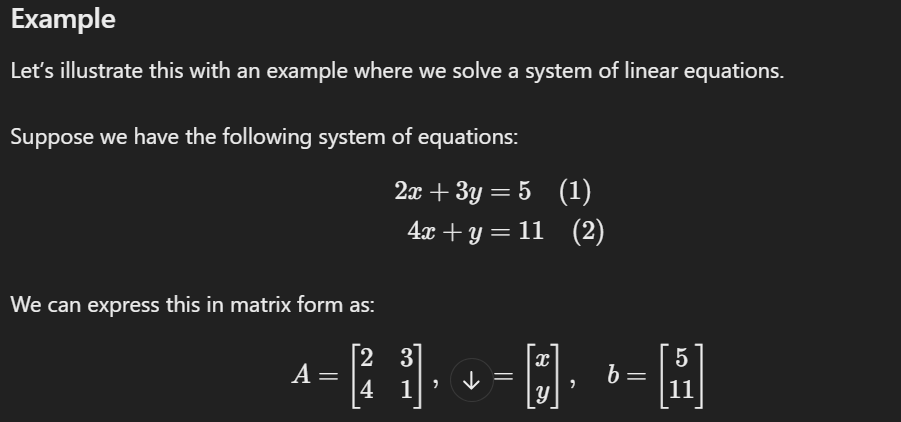

### Given Equations

We have the following system of equations:

1. \(2x + 3y = 5\)  (Equation 1)
2. \(4x + y = 11\)   (Equation 2)

### Step 1: Isolate One Variable

We can isolate one of the variables from one of the equations. Let's solve Equation 2 for \(y\):

\[
y = 11 - 4x \quad \text{(Rearranging Equation 2)}
\]

### Step 2: Substitute into the Other Equation

Now that we have \(y\) in terms of \(x\), we can substitute this expression into Equation 1:

\[
2x + 3(11 - 4x) = 5
\]

### Step 3: Simplify the Equation

Now let's simplify the equation:

1. Distribute the \(3\):
   \[
   2x + 33 - 12x = 5
   \]

2. Combine like terms:
   \[
   -10x + 33 = 5
   \]

3. Subtract \(33\) from both sides:
   \[
   -10x = 5 - 33
   \]
   \[
   -10x = -28
   \]

4. Divide both sides by \(-10\):
   \[
   x = \frac{-28}{-10} = \frac{28}{10} = 2.8
   \]

### Step 4: Substitute Back to Find \(y\)

Now that we have \(x\), we can substitute \(x = 2.8\) back into the equation we derived for \(y\):

\[
y = 11 - 4(2.8)
\]
\[
y = 11 - 11.2
\]
\[
y = -0.2
\]

### Solution

Thus, the solution to the system of equations is:

- \(x = 2.8\)
- \(y = -0.2\)

### Verification

Let's verify by plugging these values back into the original equations:

1. **Equation 1**: 
   \[
   2(2.8) + 3(-0.2) = 5 \quad \text{(Check: } 5.6 - 0.6 = 5\text{, True)}
   \]

2. **Equation 2**: 
   \[
    
   4(2.8) + (-0.2) = 11 \quad \text{(Check: } 11.2 - 0.2 = 11\text{, True)}
   \]

Both equations are satisfied, confirming that our solution is correct.
