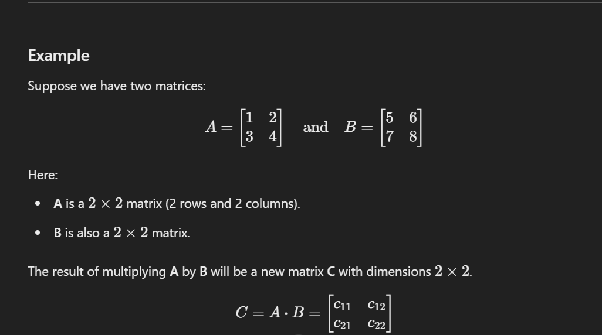

Matrix multiplication for 2D arrays (also called **matrix multiplication** or **dot product**) is a method of multiplying two matrices. It’s different from element-wise multiplication because it follows specific rules based on the dimensions of the matrices.

Here's how it works:

1. **Dimensions Requirement**: For matrix multiplication, the **number of columns** in the first matrix must equal the **number of rows** in the second matrix.
   - If matrix **A** is \( m \times n \) (m rows, n columns) and matrix **B** is \( n \times p \) (n rows, p columns), the resulting matrix **C** will be of size \( m \times p \).
   
2. **Multiplication Process**: Each element in the resulting matrix is calculated by taking a **row** from the first matrix and a **column** from the second matrix, multiplying each pair of corresponding elements, and then summing them up.

Let's walk through a detailed example to make this clearer.

---

Each element in **C** is calculated as follows:

1. **Calculate \( c_{11} \)**: The element in the first row and first column of **C**.
   \[
   c_{11} = (1 \times 5) + (2 \times 7) = 5 + 14 = 19
   \]

2. **Calculate \( c_{12} \)**: The element in the first row and second column of **C**.
   \[
   c_{12} = (1 \times 6) + (2 \times 8) = 6 + 16 = 22
   \]

3. **Calculate \( c_{21} \)**: The element in the second row and first column of **C**.
   \[
   c_{21} = (3 \times 5) + (4 \times 7) = 15 + 28 = 43
   \]

4. **Calculate \( c_{22} \)**: The element in the second row and second column of **C**.
   \[
   c_{22} = (3 \times 6) + (4 \times 8) = 18 + 32 = 50
   \]

So, the resulting matrix **C** after multiplying **A** and **B** is:

---

### Summary of Steps

To multiply two matrices:
1. Make sure the number of columns in the first matrix equals the number of rows in the second matrix.
2. For each position in the result matrix, take the corresponding row from the first matrix and the column from the second matrix, multiply each pair of elements, and sum the products.
3. Place the summed result in the corresponding position in the result matrix.

This method of multiplication is widely used in various fields, including graphics, data science, and machine learning.
